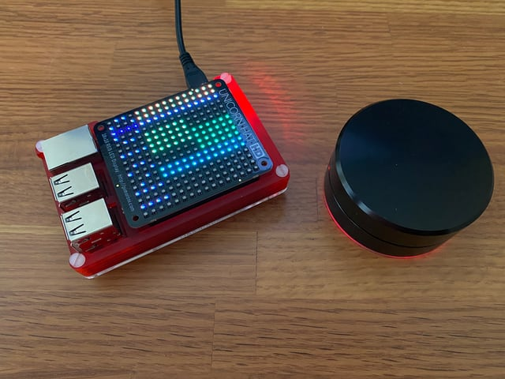

# Unicalcorn &middot; 

Quick glance your calendar schedule

- Small footprint via [Raspberry Pi](https://www.raspberrypi.org/products/raspberry-pi-4-model-b/)
- Uses an [Unicorn Hat HD](https://shop.pimoroni.com/products/unicorn-hat-hd) to render a 4h window of calendar entries
- Syncs to a public iCal URL
- Look back 24h or forward 48h via a Griffin Powermate

## Documentation

- [Bill of Materials](/docs/bom.md)
- [Installation](/docs/installation.md)
